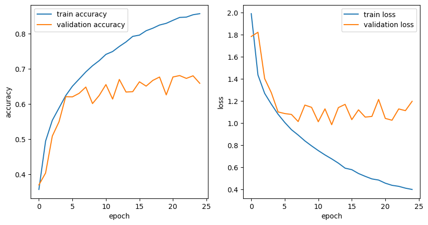
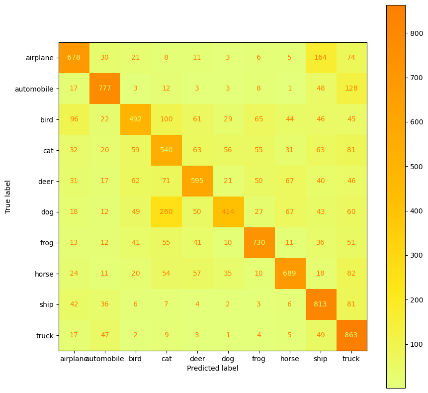

# CIFAR-10 Image Classification using Convolutional Neural Networks

## Description

The CIFAR-10 dataset is a collection of 60,000 32x32 color images, with each of the images falling into one of ten different categories. These categories are: airplanes, automobiles, birds, cats, deers, dogs, frogs, horses, ships, and trucks. Using this dataset, I created a convolutional neural network to create a machine learning image classifier to classify 10,000 of the images to the correct categorical label. 

## Code


```python
# Imports
import numpy as np
import matplotlib.pyplot as plt
from tensorflow import keras
from tensorflow.keras.models import Sequential
```


```python
# Load CIFAR-10 dataset from Keras
(x_train, y_train), (x_test, y_test) = keras.datasets.cifar10.load_data()
```


```python
# Implementing One-Hot Encoding for categorical data
from tensorflow.keras.utils import to_categorical
y_cat_train = to_categorical(y_train, 10)
y_cat_test = to_categorical(y_test, 10)
```


```python
# Model
from keras import layers
model = keras.Sequential([
    layers.Conv2D(64, 7, activation = 'relu', input_shape = (32, 32, 3)),
    layers.BatchNormalization(),
    layers.MaxPool2D(pool_size = (2, 2), strides = 2),

    
    layers.Conv2D(128, 3, activation = 'relu'),
    layers.BatchNormalization(),
    layers.MaxPool2D(pool_size = (2, 2), strides = 2),

    
    layers.Conv2D(256, 3, activation = 'relu'),
    layers.BatchNormalization(),
    layers.MaxPool2D(pool_size = (2, 2), strides = 2),
    
    layers.Flatten(),
    layers.Dropout(0.5),
    
    layers.Dense(10, activation = 'softmax'),
])

model.summary()
```

    Model: "sequential_1"
    _________________________________________________________________
     Layer (type)                Output Shape              Param #   
    =================================================================
     conv2d_3 (Conv2D)           (None, 26, 26, 64)        9472      
                                                                     
     batch_normalization (Batch  (None, 26, 26, 64)        256       
     Normalization)                                                  
                                                                     
     max_pooling2d_3 (MaxPoolin  (None, 13, 13, 64)        0         
     g2D)                                                            
                                                                     
     conv2d_4 (Conv2D)           (None, 11, 11, 128)       73856     
                                                                     
     batch_normalization_1 (Bat  (None, 11, 11, 128)       512       
     chNormalization)                                                
                                                                     
     max_pooling2d_4 (MaxPoolin  (None, 5, 5, 128)         0         
     g2D)                                                            
                                                                     
     conv2d_5 (Conv2D)           (None, 3, 3, 256)         295168    
                                                                     
     batch_normalization_2 (Bat  (None, 3, 3, 256)         1024      
     chNormalization)                                                
                                                                     
     max_pooling2d_5 (MaxPoolin  (None, 1, 1, 256)         0         
     g2D)                                                            
                                                                     
     flatten_1 (Flatten)         (None, 256)               0         
                                                                     
     dropout_1 (Dropout)         (None, 256)               0         
                                                                     
     dense_1 (Dense)             (None, 10)                2570      
                                                                     
    =================================================================
    Total params: 382858 (1.46 MB)
    Trainable params: 381962 (1.46 MB)
    Non-trainable params: 896 (3.50 KB)
    _________________________________________________________________
    


```python
from keras.callbacks import ModelCheckpoint, EarlyStopping
model.compile(loss='categorical_crossentropy', optimizer="Adam", metrics=['accuracy'])

CIFAR = model.fit(x_train, y_cat_train, batch_size=32, epochs=25, validation_split=0.2, callbacks=[EarlyStopping(monitor='loss', patience=3)])
```

    Epoch 1/25
    1250/1250 [==============================] - 30s 24ms/step - loss: 1.9887 - accuracy: 0.3565 - val_loss: 1.7823 - val_accuracy: 0.3693
    Epoch 2/25
    1250/1250 [==============================] - 30s 24ms/step - loss: 1.4341 - accuracy: 0.4945 - val_loss: 1.8204 - val_accuracy: 0.4034
    Epoch 3/25
    1250/1250 [==============================] - 30s 24ms/step - loss: 1.2674 - accuracy: 0.5534 - val_loss: 1.4011 - val_accuracy: 0.5085
    Epoch 4/25
    1250/1250 [==============================] - 30s 24ms/step - loss: 1.1693 - accuracy: 0.5886 - val_loss: 1.2728 - val_accuracy: 0.5493
    Epoch 5/25
    1250/1250 [==============================] - 29s 24ms/step - loss: 1.0788 - accuracy: 0.6238 - val_loss: 1.0995 - val_accuracy: 0.6209
    Epoch 6/25
    1250/1250 [==============================] - 30s 24ms/step - loss: 1.0044 - accuracy: 0.6507 - val_loss: 1.0848 - val_accuracy: 0.6204
    Epoch 7/25
    1250/1250 [==============================] - 30s 24ms/step - loss: 0.9388 - accuracy: 0.6710 - val_loss: 1.0767 - val_accuracy: 0.6304
    Epoch 8/25
    1250/1250 [==============================] - 30s 24ms/step - loss: 0.8904 - accuracy: 0.6914 - val_loss: 1.0124 - val_accuracy: 0.6483
    Epoch 9/25
    1250/1250 [==============================] - 32s 26ms/step - loss: 0.8376 - accuracy: 0.7090 - val_loss: 1.1616 - val_accuracy: 0.6013
    Epoch 10/25
    1250/1250 [==============================] - 34s 27ms/step - loss: 0.7922 - accuracy: 0.7236 - val_loss: 1.1410 - val_accuracy: 0.6244
    Epoch 11/25
    1250/1250 [==============================] - 33s 27ms/step - loss: 0.7497 - accuracy: 0.7414 - val_loss: 1.0107 - val_accuracy: 0.6554
    Epoch 12/25
    1250/1250 [==============================] - 34s 27ms/step - loss: 0.7104 - accuracy: 0.7496 - val_loss: 1.1273 - val_accuracy: 0.6141
    Epoch 13/25
    1250/1250 [==============================] - 33s 27ms/step - loss: 0.6747 - accuracy: 0.7641 - val_loss: 0.9839 - val_accuracy: 0.6700
    Epoch 14/25
    1250/1250 [==============================] - 33s 26ms/step - loss: 0.6360 - accuracy: 0.7769 - val_loss: 1.1387 - val_accuracy: 0.6341
    Epoch 15/25
    1250/1250 [==============================] - 33s 26ms/step - loss: 0.5905 - accuracy: 0.7928 - val_loss: 1.1680 - val_accuracy: 0.6352
    Epoch 16/25
    1250/1250 [==============================] - 31s 25ms/step - loss: 0.5770 - accuracy: 0.7964 - val_loss: 1.0298 - val_accuracy: 0.6633
    Epoch 17/25
    1250/1250 [==============================] - 31s 25ms/step - loss: 0.5422 - accuracy: 0.8088 - val_loss: 1.1185 - val_accuracy: 0.6510
    Epoch 18/25
    1250/1250 [==============================] - 30s 24ms/step - loss: 0.5166 - accuracy: 0.8161 - val_loss: 1.0527 - val_accuracy: 0.6673
    Epoch 19/25
    1250/1250 [==============================] - 33s 27ms/step - loss: 0.4933 - accuracy: 0.8251 - val_loss: 1.0589 - val_accuracy: 0.6769
    Epoch 20/25
    1250/1250 [==============================] - 34s 27ms/step - loss: 0.4829 - accuracy: 0.8299 - val_loss: 1.2125 - val_accuracy: 0.6261
    Epoch 21/25
    1250/1250 [==============================] - 34s 27ms/step - loss: 0.4546 - accuracy: 0.8385 - val_loss: 1.0408 - val_accuracy: 0.6770
    Epoch 22/25
    1250/1250 [==============================] - 34s 27ms/step - loss: 0.4353 - accuracy: 0.8468 - val_loss: 1.0244 - val_accuracy: 0.6811
    Epoch 23/25
    1250/1250 [==============================] - 33s 26ms/step - loss: 0.4261 - accuracy: 0.8477 - val_loss: 1.1266 - val_accuracy: 0.6730
    Epoch 24/25
    1250/1250 [==============================] - 30s 24ms/step - loss: 0.4096 - accuracy: 0.8544 - val_loss: 1.1111 - val_accuracy: 0.6804
    Epoch 25/25
    1250/1250 [==============================] - 30s 24ms/step - loss: 0.3979 - accuracy: 0.8575 - val_loss: 1.1956 - val_accuracy: 0.6590
    

## Evaluation


```python
plt.figure(figsize=(10, 5))

plt.subplot(1, 2, 1)
plt.plot(CIFAR.history['accuracy'], label='train accuracy')
plt.plot(CIFAR.history['val_accuracy'], label='validation accuracy')
plt.xlabel('epoch')
plt.ylabel('accuracy')
plt.legend()

plt.subplot(1, 2, 2)
plt.plot(CIFAR.history['loss'], label='train loss')
plt.plot(CIFAR.history['val_loss'], label='validation loss')
plt.xlabel('epoch')
plt.ylabel('loss')
plt.legend()

loss, acc = model.evaluate(x_train, y_cat_train, verbose=0)
print("Train accuracy:", acc * 100)
```

    Train accuracy: 84.95399951934814
    


    

    


In order to see the improvement of the model during training, I plotted out the training and validation accuracy and loss after each epoch. From the graph, we can see that although the model had a lower training loss and was increasing in accuracy after each epoch in training, these improvements started to diverge as the accuracy and loss stopped improving at around the fifth epoch. This of course meant that the model began overfitting to the training data and was failing to properly classify unseen data and ended up with a with a final test accuracy of 65%.


```python
from sklearn.metrics import classification_report, confusion_matrix

y_pred = model.predict(x_test)
y_pred = np.argmax(y_pred, axis=1)
print(classification_report(y_test, y_pred))
loss, acc = model.evaluate(x_test, y_cat_test, verbose=0)
print("Test accuracy:", acc * 100)
```

    313/313 [==============================] - 2s 6ms/step
                  precision    recall  f1-score   support
    
               0       0.70      0.68      0.69      1000
               1       0.79      0.78      0.78      1000
               2       0.65      0.49      0.56      1000
               3       0.48      0.54      0.51      1000
               4       0.67      0.59      0.63      1000
               5       0.72      0.41      0.53      1000
               6       0.76      0.73      0.75      1000
               7       0.74      0.69      0.72      1000
               8       0.62      0.81      0.70      1000
               9       0.57      0.86      0.69      1000
    
        accuracy                           0.66     10000
       macro avg       0.67      0.66      0.65     10000
    weighted avg       0.67      0.66      0.65     10000
    
    Test accuracy: 65.90999960899353
    


```python
from sklearn.metrics import ConfusionMatrixDisplay

fig, ax = plt.subplots(figsize=(10, 10))
mat = ConfusionMatrixDisplay(confusion_matrix=confusion_matrix(y_test, y_pred), display_labels=['airplane', 'automobile', 'bird', 'cat', 'deer', 'dog', 'frog', 'horse', 'ship', 'truck'])
mat = mat.plot(ax=ax,cmap='Wistia')
plt.show()
```

    313/313 [==============================] - 2s 6ms/step
    


    

    


From the confusion matrix of the true and predicted labels, it is clear that dogs were the class most often misclassified, followed by birds and then cats. By looking at the misclassifications, we can get an insight on some of the features from each class that the neural network might have picked up on and used to make a classification. For example, the model most often misclassified dogs as cats, which is understandable as they are both four-legged animals with similar body shapes. As well as this, the model also often misclassified airplanes to be birds, which could be due to their similarities of having wings, but it did not misclassify often in the other direction. Curiously, it also mixed up ships, trucks, automobiles, and airplanes, all of which are metallic man-made objects, This could be due to similar colors of each object. 


```python

```
